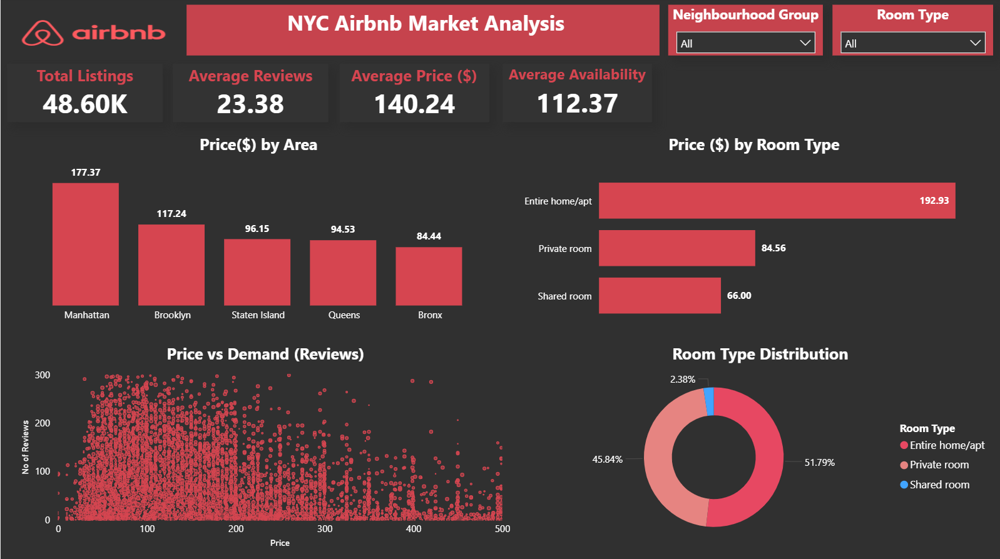
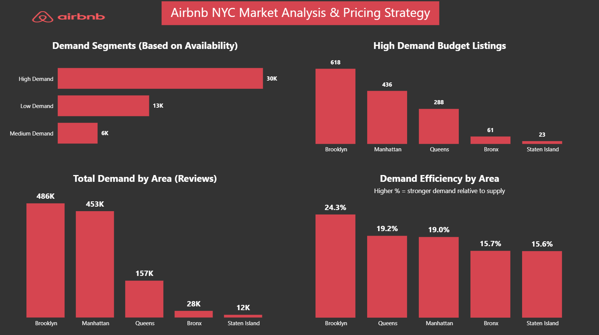

# Airbnb NYC Market Analysis

## Project Highlights
- Performed End-to-end data analysis using Python, SQL, and Power BI
- Identified high-demand affordable listings and pricing opportunities
- Built an interactive Power BI dashboard for business decision-making
- Developed a custom Demand-to-Supply Ratio metric to evaluate market efficiency
  
---

## Overview
This project analyzes Airbnb listings in New York City to uncover insights into pricing behavior, demand patterns, and market efficiency.
The goal was to simulate a real-world data analyst workflow — from data cleaning and transformation to SQL-based analysis and dashboard storytelling.

---

## Tools & Technologies
- Python (pandas) → Data cleaning & preprocessing
- SQL (MySQL) → Data querying & aggregation
- Power BI → Data visualization & dashboard creation

---

## Tasks Performed
- Cleaned dataset by handling missing values and correcting data formats
- Standardized date fields and removed irrelevant columns
- Filtered out outliers to improve analysis accuracy
- Performed exploratory data analysis (EDA) to understand key trends
- Wrote SQL queries to analyze pricing, demand, and location-based patterns
- Designed an interactive Power BI dashboard with multiple analytical views

---

## Key Insights
- Manhattan has the highest average listing prices
- Entire homes dominate the premium pricing segment
- Lower-priced listings attract significantly more reviews (higher engagement)
- Affordable listings (< $100) consistently perform better
- A Demand-to-Supply Ratio was created to evaluate how efficiently listings convert availability into bookings

---

##  Dashboard Preview

### Power BI Dashboard

---

## Conclusion
This project demonstrates how data can be used to move beyond visualization and support strategic decision-making in a competitive marketplace.

---

